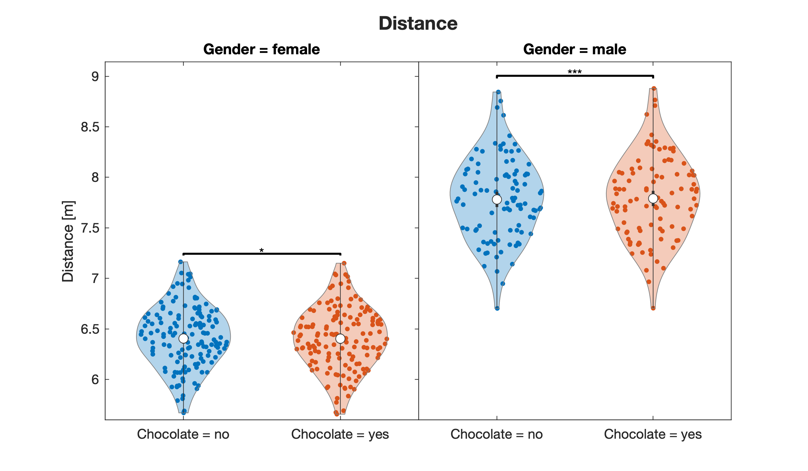

# kbstat

A highly configurable statistical library to perform script-based generalised linear model analysis and post-hoc testing. Results and diagnostic plots are saved as Excel and CSV tables, MATLAB, PNG and PDF figures and TXT files to a directory of choice.

## Disclaimer

This library come without any warranty and is for free use only. See the LICENSE file in the root folder.

The library uses an adaptation of Bastian Bechtold's Violin plot library, available at https://github.com/bastibe/Violinplot-Matlab, for plotting and John Hartman's emmeans library, available at https://de.mathworks.com/matlabcentral/fileexchange/71970-emmeans, for post-hoc analysis. 

## How to use

Analysis is performed by calling the script `kbstat` with an `options` structure as the only argument. For the vailable options, see the header in `kbstat`. Before calling the script, the library folder including subfolders must be added to the search path.

## Example

In MATLAB, change to the `demo` folder and run the `kbstat_demo` script. The demo script illustrates the GLM analysis of artificially generated data for the fictional scenario of male and female athletes performing long jumps with and without having eaten chocolate beforehand. The results are stored in a folder called `Results`, which is created if it does not exist, otherwise its contents are overwritten. 

Here is a minimal example:

```matlab
options = struct; % Init empty structure
options.inFile = 'Data.csv'; % Relative path to input file in long format as CSV table
options.outDir = 'Results'; % Relative path to output folder
options.y = 'Distance'; % Dependent variable of model
options.yUnits = 'm'; % Units of dependent variable
options.x = 'Factor1, Factor2'; % Fixed-effect variables
options.id = 'Subject'; % Random-effect variable
kbstat(options); % Call main script with the given options
```
The demo script produces several files, in particular the data plot,



and the diagnostic plot


## How to cite

When using this script in your publications, cite it using the following APA citation or its equivalent:

Bostroem, K. J. (2024). kbstat (Version 1.1.4) [Computer software]. https://github.com/kimbostroem/kbstat
